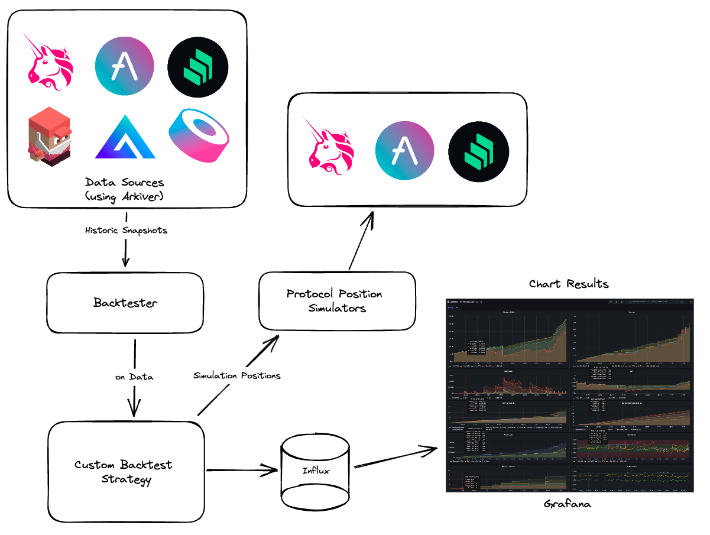
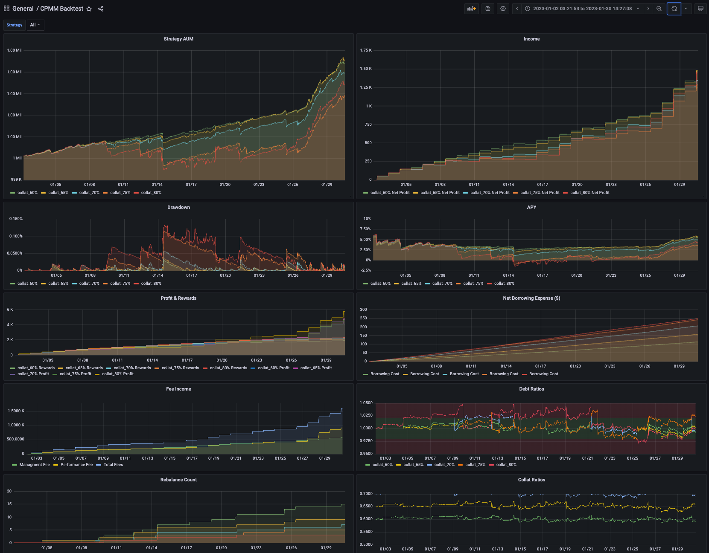

# Web3 Backtest

Web3 Backtest is a generic Backtesting library for DeFi trading strategies. The library simplifies pullling historic data, simulating protocols, backtest metrics, charting and analytics. 



## Historic Data
Web3 Backtester pull desired historic data using (arkiver)[https://github.com/RoboVault/robo-arkiver]. All data is formatted into snaphots with resolutions of 1m, 1h, or 1day. transaction- or block-resolution may be added in the future.  

Datasources are specified with a simple configuration
```ts 
const sources: DataSourceInfo[] = [
    {
        chain: 'arbitrum',
        protocol: 'camelot-dex',
        resoution: '1m',
        config: {
            pairs: [USDCWETH]
        }
    },
]
```
Supported sources are detailed (below)[#Data Sources Supported]

## Position Simulation

The library contains helper classes that simulate openning, changing and closing defi positions. For example, the Univ2PositionManager will simulation a position with:

```ts
const univ2 = new UniV2PositionManager()
const position = univ2.addLiquidity('WETH/USDC', 1, 1900);
```

and as cycles pass in the backtest, the position can be monitored and altered
```ts
if (position.valueUsd < 2500) {
    { token0, token1 } = position.close()
}
```

Simulators are in the early stages, the API will change. See (Supported Positions Simulators)[#Position-Simulators]

## Data storage and Analytics

There is a docker-compose.yml file that will spin up an influx db and a local instance of grafana so you can store any data you like during the backtest and have plenty of charting flexibility with grafana. 




## Simplifying Code Structure

Web3 Backtester has a simple API that grants flexibility. The steps are:
1. Specify Data Sources
2. Specify Testing Period
3. Register Handlers
4. Run the backtest

Here's an example that creates a dummy backtest for a 10 day period, using Camelot 1m resolution data. 

```ts
const main = async () => {
    const USDCWETH = '0x794a61358D6845594F94dc1DB02A252b5b4814aD'

    const bt = await Backtest.create(
        new Date('2023-01-01'), 
        new Date('2023-01-02'), 
        [{
            chain: 'arbitrum',
            protocol: 'camelot-dex',
            resoution: '1m',
            config: {
                pairs: [USDCWETH]
            }
        }]
    )

    bt.onData(async (update: DataSnapshot<Univ2PoolSnapshot>) => {
        console.log(`we have data for ${update.timestamp}!`)
    })

    bt.onAfter(async () => {
        console.log('backtest complete!')
    })

    bt.run()
}

main()
```

# Features
| Feature | Status  |
| -------- | -------- |
| Generic Data Sources | &check; |
| Generic Backtest API | &check; |
| Examples: Hedged Farming Strategy | &check; |
| Multi-resolution Support (1m, 1d, 1h) | &check; |
| Influx boilerplate for charting | &check; |
| NPM Module | &cross; |
| Example: AAVE Folding | &cross; |
| Wallet support for simulators | &cross; |
| Local Data Caching | &cross; |

# Position Simulators
| Protocol         | Status     |
| ---------------- | --------   |
| Univ3            | &check;    |
| Univ2            | &check;    |
| AAVE             | &check;    |
| Masterchef V2    | &check;    |
| Perp V2          | &cross;    |
| Joes V2          | &cross;    |
| GMX              | &cross;    |

# Data Sources Supported
## AMMs
| Chain    | Protocol  | Minutely | Hourly  | Hourly  |
| -------- | --------  | ---------| ------- | ------- |
| Arbitrum | Camelot   | &check;  | &cross; | &cross; |
| Arbitrum | Sushiswap | &cross;  | &cross; | &cross; |
| Arbitrum | Univ3     | &cross;  | &cross; | &cross; |

## Lending Markets
| Chain    | Protocol  | Minutely | Hourly  | Hourly  |
| -------- | --------  | ---------| ------- | ------- |
| Arbitrum | AAVE      | &cross;  | partial | &cross; |
| Avalanche| AAVE      | &cross;  | partial | &cross; |

## Farms
| Chain    | Protocol  | Minutely | Hourly  | Hourly  |
| -------- | --------  | ---------| ------- | ------- |
| Arbitrum | Camelot   | &check;  | &cross; | &cross; |
| Arbitrum | Sushiswap | &cross;  | &cross; | &cross; |
| Arbitrum | Univ3     | &cross;  | &cross; | &cross; |

# Setup

## Influx and Grafana

Grafana and influx are not required to test strategies but they are useful tools for visualising the results.

Run Grafana and influx locally with docker

```
docker-compose up -d
```

You can stop the grafana and influx containers with

```
docker-compose down -v
```

## Run a Backtest

Install deps

```
npm install
```

Run the sample backtest

```
ts-node ./src/index.ts
```

or run the larger example (required influx). First copy the .env template, then run

```
cp .env.template .env
ts-node ./src/examples/cpmm_camelot_aave/index.ts
```


# Graphana Vis

Your grafana instance is a fresh instance so there will be no dashboards, you'll need to create them. First step is setting up the influx data source with the following details

| Property       | Value                 |
| ---------------- | ----------------------- |
| name           | backtester            |
| Query Language | InfluxQL              |
| URL            | http://localhost:8086 |
| database       | backtest              |
| user           | admin                 |
| password       | admin                 |

See the /grafana folder, it contains dashboard json files for all examples. 

